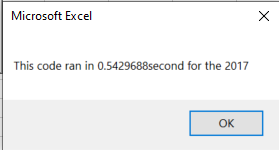
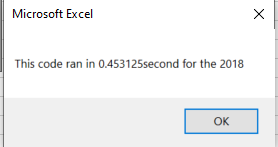
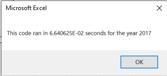
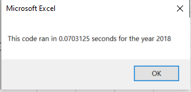

# Stock Analysis - Module 2

## Overview of Project

### Purpose
The purpose of this analysis is to help Steve do research on stocks, which includes their yearly reutrn and total daily volume. In this task specifically, the code was edited from the previous code to make it work faster, therefore Steve would be able to expand his research to more stocks and still be able to run the code in a small amount of time. 

###Results

####Run Times
The refractored code (the edited code) worked faster than the original code. The orignal code for 2017 and 2018 ran in 0.543 s and 0.453 s respectively. While the refractored code for 2017 and 2018 ran in 0.066 s and 0.070 s respectively. While using a small number of stocks this wouldn't appear as much of a difference but when looking at a significantly more stocks this time difference would start to add up! In addition the new code includes formatting, while the orignal code does not. These images show the run times of each code. In order: Origial 2017, Original 2018, Refractored 2018, Refractored 2018.     

